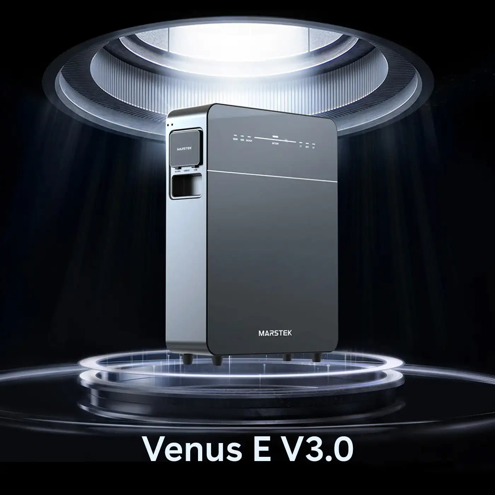

<p align="center">
  
</p>

# Marstek Venus E - Home Assistant Integration

[](https://github.com/custom-components/hacs)
[](https://opensource.org/licenses/MIT)

A comprehensive Home Assistant custom integration for the **Marstek Venus E** battery energy storage system. This integration provides full local control and monitoring via the device's UDP JSON-RPC API.

<!-- vscode-markdown-toc -->
* 1. [Features](#Features)
* 2. [Installation](#Installation)
	* 2.1. [HACS (Recommended)](#HACSRecommended)
	* 2.2. [Manual Installation](#ManualInstallation)
* 3. [Configuration](#Configuration)
	* 3.1. [Adding the Integration](#AddingtheIntegration)
	* 3.2. [Configuring Manual Schedules](#ConfiguringManualSchedules)
		* 3.2.1. [Method 1: Through the UI (Recommended for Single Slots)](#Method1:ThroughtheUIRecommendedforSingleSlots)
		* 3.2.2. [Method 2: Through Automations (Recommended for Multiple Slots)](#Method2:ThroughAutomationsRecommendedforMultipleSlots)
* 4. [Entities](#Entities)
	* 4.1. [Sensors](#Sensors)
		* 4.1.1. [Battery](#Battery)
		* 4.1.2. [Solar PV](#SolarPV)
		* 4.1.3. [Grid & Energy](#GridEnergy)
		* 4.1.4. [CT Meter (if installed)](#CTMeterifinstalled)
		* 4.1.5. [System](#System)
	* 4.2. [Binary Sensors](#BinarySensors)
	* 4.3. [Select Entities](#SelectEntities)
* 5. [Services](#Services)
	* 5.1. [`marstek_venus_e.set_mode`](#marstek_venus_e.set_mode)
	* 5.2. [`marstek_venus_e.set_manual_schedule`](#marstek_venus_e.set_manual_schedule)
	* 5.3. [`marstek_venus_e.set_passive_mode`](#marstek_venus_e.set_passive_mode)
* 6. [Lovelace Dashboard Examples](#LovelaceDashboardExamples)
	* 6.1. [Battery Status Card](#BatteryStatusCard)
	* 6.2. [Energy Flow Card](#EnergyFlowCard)
	* 6.3. [Complete Dashboard](#CompleteDashboard)
* 7. [Energy Dashboard Configuration](#EnergyDashboardConfiguration)
* 8. [Automation Examples](#AutomationExamples)
	* 8.1. [Auto-Configure All 10 Schedules When Switching to Manual Mode](#Auto-ConfigureAll10SchedulesWhenSwitchingtoManualMode)
	* 8.2. [Charge Battery During Cheap Hours (Single Slot)](#ChargeBatteryDuringCheapHoursSingleSlot)
	* 8.3. [Switch to Auto During Day](#SwitchtoAutoDuringDay)
	* 8.4. [Low Battery Alert](#LowBatteryAlert)
	* 8.5. [Maximize Self-Consumption](#MaximizeSelf-Consumption)
* 9. [Troubleshooting](#Troubleshooting)
	* 9.1. [Integration Not Appearing](#IntegrationNotAppearing)
	* 9.2. [Cannot Connect to Device](#CannotConnecttoDevice)
	* 9.3. [Missing Sensors](#MissingSensors)
	* 9.4. [Enable Debug Logging](#EnableDebugLogging)
* 10. [API Reference](#APIReference)
* 11. [Support](#Support)
* 12. [Contributing](#Contributing)
* 13. [License](#License)
* 14. [Disclaimer](#Disclaimer)
* 15. [Credits](#Credits)

<!-- vscode-markdown-toc-config
	numbering=true
	autoSave=true
	/vscode-markdown-toc-config -->
<!-- /vscode-markdown-toc -->

##  1. <a name='Features'></a>Features

✅ **Automatic Device Discovery**
- UDP broadcast discovery on local network
- Automatic device detection during setup
- Manual IP entry fallback option

✅ **Complete Monitoring**
- Battery status (SOC, temperature, capacity, charge/discharge state)
- Solar PV generation (power, voltage, current)
- Grid power flow (import/export)
- Energy totals (PV, grid, load)
- CT clamp readings (3-phase power monitoring)
- WiFi signal strength

✅ **Full Control**
- **UI Mode Selector**: Change modes directly from Home Assistant UI
- **UI Schedule Configuration**: Set up charging/discharging schedules through UI (no YAML needed)
- **Operating Modes**: Auto (Self-Consuming), AI, Manual, Passive
- Real-time mode changes
- Up to 10 time-based schedules (slots 0-9)
- **Automation Support**: Configure all 10 schedules via Home Assistant automations

✅ **Home Assistant Integration**
- Native Energy Dashboard support
- Service calls for automation
- Select entity for easy mode switching
- Options flow for schedule configuration
- 5-minute polling interval (configurable via options)
- Non-blocking async implementation
- Comprehensive device information
- Multi-language support (English, French)

##  2. <a name='Installation'></a>Installation

###  2.1. <a name='HACSRecommended'></a>HACS (Recommended)

1. Open HACS in Home Assistant
2. Click the three dots in the top right corner
3. Select "Custom repositories"
4. Add this repository URL: `https://github.com/YOUR-USERNAME/marstek-venus-e`
5. Category: `Integration`
6. Click "Add"
7. Find "Marstek Venus E" in HACS and click "Download"
8. Restart Home Assistant

###  2.2. <a name='ManualInstallation'></a>Manual Installation

1. Copy the `custom_components/marstek_venus_e` folder to your Home Assistant's `custom_components` directory
2. Restart Home Assistant

##  3. <a name='Configuration'></a>Configuration

###  3.1. <a name='AddingtheIntegration'></a>Adding the Integration

1. Go to **Settings** → **Devices & Services**
2. Click **+ Add Integration**
3. Search for "Marstek Venus E"
4. **Automatic Discovery**:
   - The integration scans your network for Marstek devices
   - Found devices are displayed in a list
   - Select your device and click Submit
5. **Manual Configuration** (if no devices found):
   - Select "Enter IP manually"
   - Enter device IP address, port (30000), and optional BLE MAC
   - Click Submit

###  3.2. <a name='ConfiguringManualSchedules'></a>Configuring Manual Schedules

After adding the integration, you can configure charging/discharging schedules in two ways:

####  3.2.1. <a name='Method1:ThroughtheUIRecommendedforSingleSlots'></a>Method 1: Through the UI (Recommended for Single Slots)

1. Go to **Settings** → **Devices & Services**
2. Find **Marstek Venus E** integration
3. Click **Configure** (gear icon)
4. Select **"Configure Manual Mode Schedule"**
5. Set up your schedule:
   - **Time Slot**: Choose 0-9 (you can create 10 different schedules)
   - **Start/End Time**: When the schedule runs
   - **Active Days**: Select days of the week
   - **Power**: Negative to charge (-1000W), positive to discharge (+1000W)
   - **Enable**: Toggle to activate
6. Click Submit

####  3.2.2. <a name='Method2:ThroughAutomationsRecommendedforMultipleSlots'></a>Method 2: Through Automations (Recommended for Multiple Slots)

Configure all 10 schedule slots automatically when you switch to Manual mode using Home Assistant automations. This is the easiest way to set up complex schedules!

**Quick Start:**
1. Copy the example automation from `example_automation.yaml` in this repository
2. Paste it into your Home Assistant automations
3. Adjust times, power levels, and days to match your needs
4. Save and test by switching to Manual mode!

**Benefits:**
- Configure all 10 slots in one action
- Different schedules for weekdays vs weekends
- Dynamic schedules based on battery level, weather, or electricity prices
- Seasonal adjustments (winter vs summer patterns)

See the **[Manual Mode Automation Guide](MANUAL_MODE_AUTOMATION_GUIDE.md)** for detailed examples and best practices.

##  4. <a name='Entities'></a>Entities

###  4.1. <a name='Sensors'></a>Sensors

####  4.1.1. <a name='Battery'></a>Battery
- `sensor.marstek_venus_e_battery_state_of_charge` - Battery SOC (%)
- `sensor.marstek_venus_e_battery_temperature` - Battery temperature (°C)
- `sensor.marstek_venus_e_battery_capacity` - Current battery capacity (Wh)
- `sensor.marstek_venus_e_battery_rated_capacity` - Rated battery capacity (Wh)
- `sensor.marstek_venus_e_battery_power` - Battery charging/discharging power (W)

####  4.1.2. <a name='SolarPV'></a>Solar PV
- `sensor.marstek_venus_e_pv_power` - Solar generation power (W)
- `sensor.marstek_venus_e_pv_voltage` - PV voltage (V)
- `sensor.marstek_venus_e_pv_current` - PV current (A)

####  4.1.3. <a name='GridEnergy'></a>Grid & Energy
- `sensor.marstek_venus_e_grid_power` - Grid import/export power (W)
- `sensor.marstek_venus_e_offgrid_power` - Off-grid power (W)
- `sensor.marstek_venus_e_total_pv_energy` - Total PV energy generated (kWh)
- `sensor.marstek_venus_e_total_grid_export_energy` - Total energy exported to grid (kWh)
- `sensor.marstek_venus_e_total_grid_import_energy` - Total energy imported from grid (kWh)
- `sensor.marstek_venus_e_total_load_energy` - Total load consumption (kWh)

####  4.1.4. <a name='CTMeterifinstalled'></a>CT Meter (if installed)
- `sensor.marstek_venus_e_phase_a_power` - Phase A power (W)
- `sensor.marstek_venus_e_phase_b_power` - Phase B power (W)
- `sensor.marstek_venus_e_phase_c_power` - Phase C power (W)
- `sensor.marstek_venus_e_total_ct_power` - Total CT power (W)

####  4.1.5. <a name='System'></a>System
- `sensor.marstek_venus_e_wifi_signal_strength` - WiFi RSSI (dBm)
- `sensor.marstek_venus_e_wifi_ssid` - Connected WiFi network
- `sensor.marstek_venus_e_operating_mode` - Current operating mode

###  4.2. <a name='BinarySensors'></a>Binary Sensors
- `binary_sensor.marstek_venus_e_battery_charging` - Battery charging status
- `binary_sensor.marstek_venus_e_battery_discharging` - Battery discharging status
- `binary_sensor.marstek_venus_e_ct_meter_connected` - CT meter connection status

###  4.3. <a name='SelectEntities'></a>Select Entities
- `select.operating_mode` - Change operating mode (Auto, AI, Manual, Passive)
  - **Auto**: Self-consumption optimization
  - **AI**: Intelligent mode based on usage patterns
  - **Manual**: Time-based schedules (configure via integration options)
  - **Passive**: Fixed power target mode

##  5. <a name='Services'></a>Services

###  5.1. <a name='marstek_venus_e.set_mode'></a>`marstek_venus_e.set_mode`

Set the operating mode of your system.

**Modes:**
- `Auto` - Automatic operation based on device algorithms
- `AI` - AI-optimized operation
- `Manual` - Time-based schedule control
- `Passive` - Follow a specific power target

```yaml
service: marstek_venus_e.set_mode
data:
  mode: "Auto"
```

###  5.2. <a name='marstek_venus_e.set_manual_schedule'></a>`marstek_venus_e.set_manual_schedule`

Configure a manual charging/discharging schedule.

```yaml
service: marstek_venus_e.set_manual_schedule
data:
  time_num: 0  # Time slot 0-9 (10 slots available!)
  start_time: "09:00"
  end_time: "17:00"  # MUST be greater than start_time
  week_set: 127  # All days (byte-based: 1=Mon, 2=Tue, 4=Wed, 8=Thu, 16=Fri, 32=Sat, 64=Sun)
  mode: "Charging"  # "Charging" or "Discharging"
  power: 500  # 100-800W magnitude (always positive)
  enable: true
```

**Important Constraints:**
- `end_time` must be greater than `start_time`
- `mode` must be "Charging" (negative power) or "Discharging" (positive power)
- `power` magnitude must be between 100 and 800 watts (always positive)
- `week_set` uses byte-based bitmask

**Week Set Bitmask:**
- Monday: 1
- Tuesday: 2
- Wednesday: 4
- Thursday: 8
- Friday: 16
- Saturday: 32
- Sunday: 64
- All days: 127 (sum of all)
- Weekdays only: 31
- Weekend only: 96

###  5.3. <a name='marstek_venus_e.set_passive_mode'></a>`marstek_venus_e.set_passive_mode`

Set passive mode with a power target.

```yaml
service: marstek_venus_e.set_passive_mode
data:
  power: 2000  # Target power in watts
  cd_time: 3600  # Countdown in seconds (0 = indefinite)
```

##  6. <a name='LovelaceDashboardExamples'></a>Lovelace Dashboard Examples

###  6.1. <a name='BatteryStatusCard'></a>Battery Status Card

```yaml
type: vertical-stack
cards:
  - type: gauge
    entity: sensor.marstek_venus_e_battery_state_of_charge
    name: Battery Level
    min: 0
    max: 100
    needle: true
    severity:
      green: 60
      yellow: 30
      red: 0
  
  - type: entities
    entities:
      - entity: sensor.marstek_venus_e_battery_power
        name: Battery Power
      - entity: sensor.marstek_venus_e_battery_temperature
        name: Temperature
      - entity: binary_sensor.marstek_venus_e_battery_charging
        name: Charging
      - entity: binary_sensor.marstek_venus_e_battery_discharging
        name: Discharging
      - entity: sensor.marstek_venus_e_battery_capacity
        name: Current Capacity
```

###  6.2. <a name='EnergyFlowCard'></a>Energy Flow Card

```yaml
type: vertical-stack
cards:
  - type: horizontal-stack
    cards:
      - type: statistic
        entity: sensor.marstek_venus_e_pv_power
        name: Solar
        icon: mdi:solar-power
        stat_type: mean
        period:
          calendar:
            period: day
      
      - type: statistic
        entity: sensor.marstek_venus_e_grid_power
        name: Grid
        icon: mdi:transmission-tower
        stat_type: mean
        period:
          calendar:
            period: day
      
      - type: statistic
        entity: sensor.marstek_venus_e_battery_power
        name: Battery
        icon: mdi:battery
        stat_type: mean
        period:
          calendar:
            period: day
  
  - type: entities
    title: Energy Today
    entities:
      - entity: sensor.marstek_venus_e_total_pv_energy
        name: PV Generated
      - entity: sensor.marstek_venus_e_total_grid_import_energy
        name: Grid Import
      - entity: sensor.marstek_venus_e_total_grid_export_energy
        name: Grid Export
      - entity: sensor.marstek_venus_e_total_load_energy
        name: Total Consumption
```

###  6.3. <a name='CompleteDashboard'></a>Complete Dashboard

```yaml
title: Marstek Venus E
type: vertical-stack
cards:
  # Header with mode
  - type: entities
    entities:
      - entity: sensor.marstek_venus_e_operating_mode
        name: Operating Mode
  
  # Battery gauge
  - type: gauge
    entity: sensor.marstek_venus_e_battery_state_of_charge
    name: Battery
    min: 0
    max: 100
    needle: true
    severity:
      green: 60
      yellow: 30
      red: 0
  
  # Power flow
  - type: horizontal-stack
    cards:
      - type: entity
        entity: sensor.marstek_venus_e_pv_power
        name: Solar
        icon: mdi:solar-power
      - type: entity
        entity: sensor.marstek_venus_e_grid_power
        name: Grid
        icon: mdi:transmission-tower
      - type: entity
        entity: sensor.marstek_venus_e_battery_power
        name: Battery
        icon: mdi:battery
  
  # Energy totals
  - type: entities
    title: Energy
    entities:
      - sensor.marstek_venus_e_total_pv_energy
      - sensor.marstek_venus_e_total_grid_import_energy
      - sensor.marstek_venus_e_total_grid_export_energy
      - sensor.marstek_venus_e_total_load_energy
  
  # Mode control buttons
  - type: horizontal-stack
    cards:
      - type: button
        name: Auto
        icon: mdi:autorenew
        tap_action:
          action: call-service
          service: marstek_venus_e.set_mode
          data:
            mode: "Auto"
      - type: button
        name: AI
        icon: mdi:brain
        tap_action:
          action: call-service
          service: marstek_venus_e.set_mode
          data:
            mode: "AI"
      - type: button
        name: Manual
        icon: mdi:clock-outline
        tap_action:
          action: call-service
          service: marstek_venus_e.set_mode
          data:
            mode: "Manual"
```

##  7. <a name='EnergyDashboardConfiguration'></a>Energy Dashboard Configuration

Add your Marstek Venus E to Home Assistant's Energy Dashboard:

1. Go to **Settings** → **Dashboards** → **Energy**
2. Click **Add Consumption**:
   - Select `sensor.marstek_venus_e_total_load_energy`
3. Click **Add Solar Production**:
   - Select `sensor.marstek_venus_e_total_pv_energy`
4. Click **Add Battery**:
   - Energy in: `sensor.marstek_venus_e_total_grid_import_energy`
   - Energy out: `sensor.marstek_venus_e_total_grid_export_energy`
5. Click **Add Grid Consumption**:
   - Grid import: `sensor.marstek_venus_e_total_grid_import_energy`
6. Click **Add Return to Grid**:
   - Grid export: `sensor.marstek_venus_e_total_grid_export_energy`

##  8. <a name='AutomationExamples'></a>Automation Examples

###  8.1. <a name='Auto-ConfigureAll10SchedulesWhenSwitchingtoManualMode'></a>Auto-Configure All 10 Schedules When Switching to Manual Mode

The best way to use Manual mode is to automatically configure all 10 schedule slots when you switch to it:

```yaml
automation:
  - alias: "Marstek - Auto-Configure on Manual Mode"
    trigger:
      - platform: state
        entity_id: select.operating_mode
        to: "Manual"
    action:
      # Slot 0: Night charging
      - service: marstek_venus_e.set_manual_schedule
        data:
          time_num: 0
          start_time: "01:00"
          end_time: "06:00"
          week_set: 127  # All days
          mode: "Charging"
          power: 800  # Charge at 800W
          enable: true
      
      # Slot 1: Morning peak discharge (weekdays)
      - service: marstek_venus_e.set_manual_schedule
        data:
          time_num: 1
          start_time: "07:00"
          end_time: "09:00"
          week_set: 31  # Weekdays only
          mode: "Discharging"
          power: 700  # Discharge at 700W
          enable: true
      
      # Slot 2: Evening peak discharge
      - service: marstek_venus_e.set_manual_schedule
        data:
          time_num: 2
          start_time: "18:00"
          end_time: "22:00"
          week_set: 127  # All days
          mode: "Discharging"
          power: 750  # Discharge at 750W
          enable: true
      
      # ... configure remaining slots 3-9 as needed
```

**📖 See the [Manual Mode Automation Guide](MANUAL_MODE_AUTOMATION_GUIDE.md) for:**
- Complete 10-slot configuration examples
- Seasonal schedules (winter vs summer)
- Dynamic schedules based on battery level
- Price-based charging strategies
- Weekend vs weekday patterns

###  8.2. <a name='ChargeBatteryDuringCheapHoursSingleSlot'></a>Charge Battery During Cheap Hours (Single Slot)

```yaml
automation:
  - alias: "Charge Battery at Night"
    trigger:
      - platform: time
        at: "23:00:00"
    action:
      - service: marstek_venus_e.set_manual_schedule
        data:
          time_num: 0
          start_time: "01:00"
          end_time: "07:00"  # Must be > start_time
          week_set: 127  # Every day
          power: 800  # Maximum (800W)
          enable: true
      - service: marstek_venus_e.set_mode
        data:
          mode: "Manual"
```

###  8.3. <a name='SwitchtoAutoDuringDay'></a>Switch to Auto During Day

```yaml
automation:
  - alias: "Auto Mode During Day"
    trigger:
      - platform: time
        at: "07:00:00"
    action:
      - service: marstek_venus_e.set_mode
        data:
          mode: "Auto"
```

###  8.4. <a name='LowBatteryAlert'></a>Low Battery Alert

```yaml
automation:
  - alias: "Low Battery Warning"
    trigger:
      - platform: numeric_state
        entity_id: sensor.marstek_venus_e_battery_state_of_charge
        below: 20
    action:
      - service: notify.mobile_app
        data:
          title: "Low Battery"
          message: "Marstek battery is at {{ states('sensor.marstek_venus_e_battery_state_of_charge') }}%"
```

###  8.5. <a name='MaximizeSelf-Consumption'></a>Maximize Self-Consumption

```yaml
automation:
  - alias: "Store Excess Solar"
    trigger:
      - platform: numeric_state
        entity_id: sensor.marstek_venus_e_pv_power
        above: 2000
    condition:
      - condition: numeric_state
        entity_id: sensor.marstek_venus_e_battery_state_of_charge
        below: 95
    action:
      - service: marstek_venus_e.set_passive_mode
        data:
          power: -2000  # Charge battery
          cd_time: 0  # Until solar drops
```

##  9. <a name='Troubleshooting'></a>Troubleshooting

###  9.1. <a name='IntegrationNotAppearing'></a>Integration Not Appearing

1. Ensure you've restarted Home Assistant after installation
2. Check `custom_components/marstek_venus_e/manifest.json` exists
3. Review Home Assistant logs for errors

###  9.2. <a name='CannotConnecttoDevice'></a>Cannot Connect to Device

1. Verify the device IP address is correct
2. Ensure device and Home Assistant are on the same network
3. Check if port 30000 (UDP) is accessible
4. Try pinging the device: `ping <device_ip>`
5. Verify the device is powered on and connected to WiFi

###  9.3. <a name='MissingSensors'></a>Missing Sensors

Some sensors depend on hardware configuration:
- CT sensors require CT clamps to be installed
- Check that the device firmware supports all API endpoints

###  9.4. <a name='EnableDebugLogging'></a>Enable Debug Logging

Add to `configuration.yaml`:

```yaml
logger:
  default: info
  logs:
    custom_components.marstek_venus_e: debug
```

Then check logs at **Settings** → **System** → **Logs**

##  10. <a name='APIReference'></a>API Reference

This integration uses the Marstek Device Local API (UDP JSON-RPC). For complete API documentation, refer to the official Marstek documentation.

##  11. <a name='Support'></a>Support

- **Issues**: [GitHub Issues](https://github.com/YOUR-USERNAME/marstek-venus-e/issues)
- **Discussions**: [GitHub Discussions](https://github.com/YOUR-USERNAME/marstek-venus-e/discussions)
- **Home Assistant Community**: [Community Forum](https://community.home-assistant.io/)

##  12. <a name='Contributing'></a>Contributing

Contributions are welcome! Please:

1. Fork the repository
2. Create a feature branch
3. Make your changes
4. Submit a pull request

##  13. <a name='License'></a>License

This project is licensed under the MIT License - see the LICENSE file for details.

##  14. <a name='Disclaimer'></a>Disclaimer

This is an unofficial integration. It is not affiliated with or endorsed by Marstek. Use at your own risk.

##  15. <a name='Credits'></a>Credits

- Integration developed for Home Assistant
- Based on Marstek Device Open API documentation
- Inspired by the Home Assistant community

---

**Enjoy your Marstek Venus E integration! ⚡🔋**
