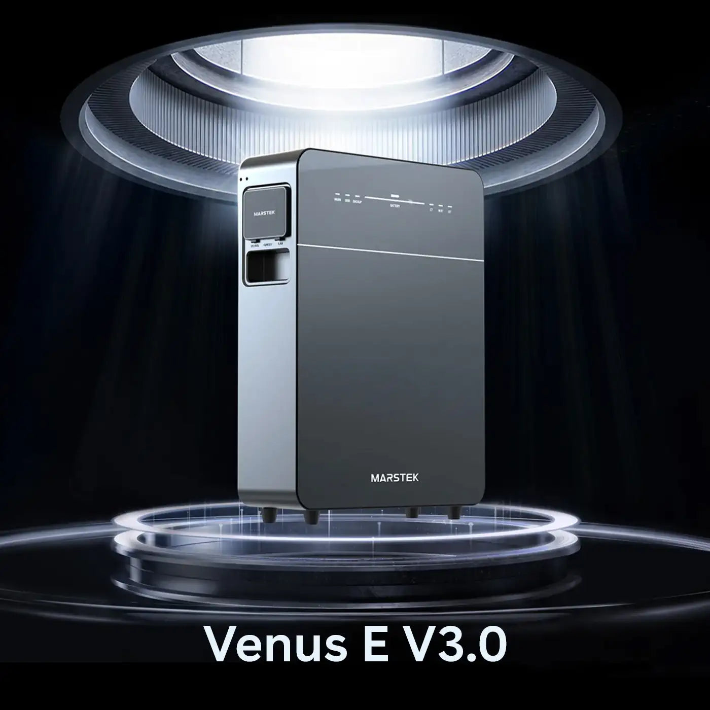

<p align="center">
  
</p>

# Marstek Venus E - Home Assistant Integration

[](https://github.com/custom-components/hacs)
[](https://opensource.org/licenses/MIT)

A comprehensive Home Assistant custom integration for the **Marstek Venus E** battery energy storage system. This integration provides full local control and monitoring via the device's UDP JSON-RPC API.

The implementation is based on **Marstek Device Open API revision 3.1**. See the [API 3.1 reference](doc/MarstekDeviceOpenApi%203.1.pdf) for the supported commands, response fields, units, and device-specific limitations.

<!-- vscode-markdown-toc -->
* 1. [Features](#Features)
* 2. [Installation](#Installation)
	* 2.1. [HACS (Recommended)](#HACSRecommended)
	* 2.2. [Manual Installation](#ManualInstallation)
* 3. [Configuration](#Configuration)
	* 3.1. [Adding the Integration](#AddingtheIntegration)
	* 3.2. [Configuring Manual Schedules](#ConfiguringManualSchedules)
		* 3.2.1. [Method 1: Through the UI (Recommended for Single Slots)](#Method1:ThroughtheUIRecommendedforSingleSlots)
		* 3.2.2. [Method 2: Through Automations (Recommended for Multiple Slots)](#Method2:ThroughAutomationsRecommendedforMultipleSlots)
* 4. [Entities](#Entities)
	* 4.1. [Sensors](#Sensors)
		* 4.1.1. [Battery](#Battery)
		* 4.1.2. [Solar PV](#SolarPV)
		* 4.1.3. [Grid & Energy](#GridEnergy)
		* 4.1.4. [CT Meter (if installed)](#CTMeterifinstalled)
		* 4.1.5. [System](#System)
	* 4.2. [Binary Sensors](#BinarySensors)
	* 4.3. [Select Entities](#SelectEntities)
* 5. [Services](#Services)
	* 5.1. [`hacs_marstek_venus_e.set_mode`](#marstek_venus_e.set_mode)
	* 5.2. [`hacs_marstek_venus_e.set_passive_mode`](#marstek_venus_e.set_passive_mode)
	* 5.3. [`hacs_marstek_venus_e.change_operating_mode`](#change_operating_mode)
* 6. [Lovelace Dashboard Examples](#LovelaceDashboardExamples)
	* 6.1. [Battery Status Card](#BatteryStatusCard)
	* 6.2. [Energy Flow Card](#EnergyFlowCard)
	* 6.3. [Complete Dashboard](#CompleteDashboard)
* 7. [Energy Dashboard Configuration](#EnergyDashboardConfiguration)
* 8. [Automation Examples](#AutomationExamples)
	* 8.1. [Configure Manual Mode](#Auto-ConfigureAll10SchedulesWhenSwitchingtoManualMode)
	* 8.2. [Switch to Auto During Day](#SwitchtoAutoDuringDay)
	* 8.3. [Low Battery Alert](#LowBatteryAlert)
	* 8.4. [Maximize Self-Consumption](#MaximizeSelf-Consumption)
* 9. [Troubleshooting](#Troubleshooting)
	* 9.1. [Integration Not Appearing](#IntegrationNotAppearing)
	* 9.2. [Cannot Connect to Device](#CannotConnecttoDevice)
	* 9.3. [Missing Sensors](#MissingSensors)
	* 9.4. [Enable Debug Logging](#EnableDebugLogging)
* 10. [API Reference](#APIReference)
* 11. [Support](#Support)
* 12. [Contribution](#Contribution)
* 13. [License](#License)
* 14. [Disclaimer](#Disclaimer)
* 15. [Credits](#Credits)

<!-- vscode-markdown-toc-config
	numbering=true
	autoSave=true
	/vscode-markdown-toc-config -->
<!-- /vscode-markdown-toc -->

##  1. <a name='Features'></a>Features

✅ **Automatic Device Discovery**
- UDP broadcast discovery on local network
- Automatic device detection during setup
- Manual IP entry fallback option

✅ **Complete Monitoring**
- Battery status (SOC, temperature, capacity, charge/discharge state)
- Solar PV generation (power, voltage, current)
- Grid power flow (import/export)
- Energy totals (PV, grid, load)
- CT clamp readings (3-phase power monitoring)
- WiFi signal strength

✅ **Full Control**
- **UI Mode Selector**: Change modes directly from Home Assistant UI
- **UI Schedule Configuration**: Set up charging/discharging schedules through UI (no YAML needed)
- **Operating Modes**: Auto (Self-Consuming), AI, Manual, Passive
- Real-time mode changes
- Up to 10 time-based schedules (slots 0-9)
- **Automation Support**: Configure all 10 schedules via Home Assistant automations

✅ **Home Assistant Integration**
- Native Energy Dashboard support
- Service calls for automation
- Select entity for easy mode switching
- Options flow for schedule configuration
- Polling interval configurable via options
- Non-blocking async implementation
- Comprehensive device information
- Multi-language support (English, French)

##  2. <a name='Installation'></a>Installation

###  2.1. <a name='HACSRecommended'></a>HACS (Recommended)

1. Open HACS in Home Assistant
2. Click the three dots in the top right corner
3. Select "Custom repositories"
4. Add this repository URL: `https://github.com/yuyuki/hacs_marstek_venus_e`
5. Category: `Integration`
6. Click "Add"
7. Find "Marstek Venus E" in HACS and click "Download"
8. Restart Home Assistant

###  2.2. <a name='ManualInstallation'></a>Manual Installation

1. Copy the `custom_components/hacs_marstek_venus_e` folder to your Home Assistant's `custom_components` directory
2. Restart Home Assistant

##  3. <a name='Configuration'></a>Configuration

###  3.1. <a name='AddingtheIntegration'></a>Adding the Integration

1. Go to **Settings** → **Devices & Services**
2. Click **+ Add Integration**
3. Search for "Marstek Venus E"
4. **Automatic Discovery**:
   - The integration scans your network for Marstek devices
   - Found devices are displayed in a list
   - Select your device and click Submit
5. **Manual Configuration** (if no devices found):
   - Select "Enter IP manually"
   - Enter device IP address, port (30000), and optional BLE MAC
   - Click Submit

###  3.2. <a name='ConfiguringManualSchedules'></a>Configuring Manual Schedules

After adding the integration, you can configure charging/discharging schedules in two ways:

####  3.2.1. <a name='Method1:ThroughtheUIRecommendedforSingleSlots'></a>Method 1: Through the UI (Recommended for Single Slots)

1. Go to **Settings** → **Devices & Services**
2. Find **Marstek Venus E** integration
3. Click **Configure** (gear icon)
4. Select **"Configure Manual Mode Schedule"**
5. Set up your schedule:
   - **Time Slot**: Choose 0-9 (you can create 10 different schedules)
   - **Start/End Time**: When the schedule runs
   - **Active Days**: Select days of the week
   - **Power**: Negative to charge (-1000W), positive to discharge (+1000W)
   - **Enable**: Toggle to activate
6. Click Submit

####  3.2.2. <a name='Method2:ThroughAutomationsRecommendedforMultipleSlots'></a>Method 2: Through Automations

Use `hacs_marstek_venus_e.change_operating_mode` to configure up to 10 slots in one action. See [the action example](#change_operating_mode). This action disables any slots you do not enable explicitly.

##  4. <a name='Entities'></a>Entities

###  4.1. <a name='Sensors'></a>Sensors

####  4.1.1. <a name='Battery'></a>Battery
- `sensor.marstek_venus_e_battery_state_of_charge` - Battery SOC (%)
- `sensor.marstek_venus_e_battery_temperature` - Battery temperature (°C)
- `sensor.marstek_venus_e_battery_capacity` - Current battery capacity (Wh)
- `sensor.marstek_venus_e_battery_rated_capacity` - Rated battery capacity (Wh)
- `sensor.marstek_venus_e_battery_power` - Battery charging/discharging power (W)

####  4.1.2. <a name='SolarPV'></a>Solar PV
- `sensor.marstek_venus_e_pv_power` - Solar generation power (W)
- `sensor.marstek_venus_e_pv_voltage` - PV voltage (V)
- `sensor.marstek_venus_e_pv_current` - PV current (A)

####  4.1.3. <a name='GridEnergy'></a>Grid & Energy
- `sensor.marstek_venus_e_grid_power` - Grid import/export power (W)
- `sensor.marstek_venus_e_offgrid_power` - Off-grid power (W)
- `sensor.marstek_venus_e_total_pv_energy` - Total PV energy generated (Wh; API 3.1 counter multiplied by 10)
- `sensor.marstek_venus_e_total_grid_export_energy` - Total energy exported to grid (Wh)
- `sensor.marstek_venus_e_total_grid_import_energy` - Total energy imported from grid (Wh)
- `sensor.marstek_venus_e_total_load_energy` - Total load consumption (Wh)

####  4.1.4. <a name='CTMeterifinstalled'></a>CT Meter (if installed)
- `sensor.marstek_venus_e_phase_a_power` - Phase A power (W)
- `sensor.marstek_venus_e_phase_b_power` - Phase B power (W)
- `sensor.marstek_venus_e_phase_c_power` - Phase C power (W)
- `sensor.marstek_venus_e_total_ct_power` - Total CT power (W)

####  4.1.5. <a name='System'></a>System
- `sensor.marstek_venus_e_wifi_signal_strength` - WiFi RSSI (dBm)
- `sensor.marstek_venus_e_wifi_ssid` - Connected WiFi network
- `sensor.marstek_venus_e_operating_mode` - Current operating mode

###  4.2. <a name='BinarySensors'></a>Binary Sensors
- `binary_sensor.marstek_venus_e_battery_charging` - Battery charging status
- `binary_sensor.marstek_venus_e_battery_discharging` - Battery discharging status
- `binary_sensor.marstek_venus_e_ct_meter_connected` - CT meter connection status

###  4.3. <a name='SelectEntities'></a>Select Entities
- `select.operating_mode` - Change operating mode (Auto, AI, Manual, Passive)
  - **Auto**: Self-consumption optimization
  - **AI**: Intelligent mode based on usage patterns
  - **Manual**: Time-based schedules (configure via integration options)
  - **Passive**: Fixed power target mode

## API 3.1 compatibility

Manual time slots are written with `ES.SetMode` and `manual_cfg`. The battery does not expose a documented schedule read endpoint. Existing schedules stay untouched during setup; use the clear schedules button or action explicitly.

The former Home Assistant action `hacs_marstek_venus_e.set_manual_schedule` has been removed. Update automations to use `change_operating_mode` for a complete schedule or the integration options to change one slot. `change_operating_mode` disables any slots not enabled in its call.

The battery can time out intermittently. Each UDP command has two attempts (30 seconds each), and commands to the same battery run sequentially. Write actions require a positive `set_result` acknowledgement. When controlling multiple batteries, select a Home Assistant device, entity, or area as a target; an omitted target retains the previous all-battery behavior. `set_mode` and `set_passive_mode` support an optional per-battery response.

**Energy statistics upgrade:** API 3.1 reports `total_pv_energy` in 0.01 kWh. The sensor now converts it to Wh (raw value × 10). If Home Assistant recorded values from an older version, review and correct historical PV statistics in Developer Tools → Statistics after upgrading; the old recorded values used a different scale.

##  5. <a name='Services'></a>Services

###  5.1. <a name='marstek_venus_e.set_mode'></a>`hacs_marstek_venus_e.set_mode`

Set the operating mode of your system.

**Modes:**
- `Auto` - Automatic operation based on device algorithms
- `AI` - AI-optimized operation
- `Manual` - Time-based schedule control
- `Passive` - Follow a specific power target

```yaml
service: hacs_marstek_venus_e.set_mode
data:
  mode: "Auto"
```

###  5.2. <a name='marstek_venus_e.set_passive_mode'></a>`hacs_marstek_venus_e.set_passive_mode`

Set passive mode with a power target.

```yaml
service: hacs_marstek_venus_e.set_passive_mode
data:
  power: 2000  # Target power in watts
  cd_time: 3600  # Countdown in seconds (0 = indefinite)
```

###  5.3. <a name='change_operating_mode'></a>`hacs_marstek_venus_e.change_operating_mode`

Configure Manual mode and its slots through a Home Assistant action. The integration sends each slot using the API 3.1 `ES.SetMode` command with `manual_cfg`. This action disables slots not marked as enabled.

```yaml
service: hacs_marstek_venus_e.change_operating_mode
data:
  mode: Manual
  slot_0_enable: true
  slot_0_start_time: "01:00"
  slot_0_end_time: "06:00"
  slot_0_mode: Charging
  slot_0_power: 500
  slot_0_days: 127
```

The day mask uses Monday=1 through Sunday=64; 127 selects every day. Slots range from 0 to 9. You can also configure one slot in the integration options without changing the other slots.

##  6. <a name='LovelaceDashboardExamples'></a>Lovelace Dashboard Examples

###  6.1. <a name='BatteryStatusCard'></a>Battery Status Card

```yaml
type: vertical-stack
cards:
  - type: gauge
    entity: sensor.marstek_venus_e_battery_state_of_charge
    name: Battery Level
    min: 0
    max: 100
    needle: true
    severity:
      green: 60
      yellow: 30
      red: 0
  
  - type: entities
    entities:
      - entity: sensor.marstek_venus_e_battery_power
        name: Battery Power
      - entity: sensor.marstek_venus_e_battery_temperature
        name: Temperature
      - entity: binary_sensor.marstek_venus_e_battery_charging
        name: Charging
      - entity: binary_sensor.marstek_venus_e_battery_discharging
        name: Discharging
      - entity: sensor.marstek_venus_e_battery_capacity
        name: Current Capacity
```

###  6.2. <a name='EnergyFlowCard'></a>Energy Flow Card

```yaml
type: vertical-stack
cards:
  - type: horizontal-stack
    cards:
      - type: statistic
        entity: sensor.marstek_venus_e_pv_power
        name: Solar
        icon: mdi:solar-power
        stat_type: mean
        period:
          calendar:
            period: day
      
      - type: statistic
        entity: sensor.marstek_venus_e_grid_power
        name: Grid
        icon: mdi:transmission-tower
        stat_type: mean
        period:
          calendar:
            period: day
      
      - type: statistic
        entity: sensor.marstek_venus_e_battery_power
        name: Battery
        icon: mdi:battery
        stat_type: mean
        period:
          calendar:
            period: day
  
  - type: entities
    title: Energy Today
    entities:
      - entity: sensor.marstek_venus_e_total_pv_energy
        name: PV Generated
      - entity: sensor.marstek_venus_e_total_grid_import_energy
        name: Grid Import
      - entity: sensor.marstek_venus_e_total_grid_export_energy
        name: Grid Export
      - entity: sensor.marstek_venus_e_total_load_energy
        name: Total Consumption
```

###  6.3. <a name='CompleteDashboard'></a>Complete Dashboard

```yaml
title: Marstek Venus E
type: vertical-stack
cards:
  # Header with mode
  - type: entities
    entities:
      - entity: sensor.marstek_venus_e_operating_mode
        name: Operating Mode
  
  # Battery gauge
  - type: gauge
    entity: sensor.marstek_venus_e_battery_state_of_charge
    name: Battery
    min: 0
    max: 100
    needle: true
    severity:
      green: 60
      yellow: 30
      red: 0
  
  # Power flow
  - type: horizontal-stack
    cards:
      - type: entity
        entity: sensor.marstek_venus_e_pv_power
        name: Solar
        icon: mdi:solar-power
      - type: entity
        entity: sensor.marstek_venus_e_grid_power
        name: Grid
        icon: mdi:transmission-tower
      - type: entity
        entity: sensor.marstek_venus_e_battery_power
        name: Battery
        icon: mdi:battery
  
  # Energy totals
  - type: entities
    title: Energy
    entities:
      - sensor.marstek_venus_e_total_pv_energy
      - sensor.marstek_venus_e_total_grid_import_energy
      - sensor.marstek_venus_e_total_grid_export_energy
      - sensor.marstek_venus_e_total_load_energy
  
  # Mode control buttons
  - type: horizontal-stack
    cards:
      - type: button
        name: Auto
        icon: mdi:autorenew
        tap_action:
          action: call-service
          service: hacs_marstek_venus_e.set_mode
          data:
            mode: "Auto"
      - type: button
        name: AI
        icon: mdi:brain
        tap_action:
          action: call-service
          service: hacs_marstek_venus_e.set_mode
          data:
            mode: "AI"
      - type: button
        name: Manual
        icon: mdi:clock-outline
        tap_action:
          action: call-service
          service: hacs_marstek_venus_e.set_mode
          data:
            mode: "Manual"
```

##  7. <a name='EnergyDashboardConfiguration'></a>Energy Dashboard Configuration

Add your Marstek Venus E to Home Assistant's Energy Dashboard:

1. Go to **Settings** → **Dashboards** → **Energy**
2. Click **Add Consumption**:
   - Select `sensor.marstek_venus_e_total_load_energy`
3. Click **Add Solar Production**:
   - Select `sensor.marstek_venus_e_total_pv_energy`
4. Click **Add Battery**:
   - Energy in: `sensor.marstek_venus_e_total_grid_import_energy`
   - Energy out: `sensor.marstek_venus_e_total_grid_export_energy`
5. Click **Add Grid Consumption**:
   - Grid import: `sensor.marstek_venus_e_total_grid_import_energy`
6. Click **Add Return to Grid**:
   - Grid export: `sensor.marstek_venus_e_total_grid_export_energy`

##  8. <a name='AutomationExamples'></a>Automation Examples

###  8.1. <a name='Auto-ConfigureAll10SchedulesWhenSwitchingtoManualMode'></a>Configure Manual Mode

Use the `hacs_marstek_venus_e.change_operating_mode` action shown above to configure enabled slots 0–9 together. Unspecified slots are disabled by that action; use the integration options to edit a single slot while keeping the others.

###  8.2. <a name='SwitchtoAutoDuringDay'></a>Switch to Auto During Day

```yaml
automation:
  - alias: "Auto Mode During Day"
    trigger:
      - platform: time
        at: "07:00:00"
    action:
      - service: hacs_marstek_venus_e.set_mode
        data:
          mode: "Auto"
```

###  8.3. <a name='LowBatteryAlert'></a>Low Battery Alert

```yaml
automation:
  - alias: "Low Battery Warning"
    trigger:
      - platform: numeric_state
        entity_id: sensor.marstek_venus_e_battery_state_of_charge
        below: 20
    action:
      - service: notify.mobile_app
        data:
          title: "Low Battery"
          message: "Marstek battery is at {{ states('sensor.marstek_venus_e_battery_state_of_charge') }}%"
```

###  8.4. <a name='MaximizeSelf-Consumption'></a>Maximize Self-Consumption

```yaml
automation:
  - alias: "Store Excess Solar"
    trigger:
      - platform: numeric_state
        entity_id: sensor.marstek_venus_e_pv_power
        above: 2000
    condition:
      - condition: numeric_state
        entity_id: sensor.marstek_venus_e_battery_state_of_charge
        below: 95
    action:
      - service: hacs_marstek_venus_e.set_passive_mode
        data:
          power: -2000  # Charge battery
          cd_time: 0  # Until solar drops
```

##  9. <a name='Troubleshooting'></a>Troubleshooting

###  9.1. <a name='IntegrationNotAppearing'></a>Integration Not Appearing

1. Ensure you've restarted Home Assistant after installation
2. Check `custom_components/hacs_marstek_venus_e/manifest.json` exists
3. Review Home Assistant logs for errors

###  9.2. <a name='CannotConnecttoDevice'></a>Cannot Connect to Device

1. Verify the device IP address is correct
2. Ensure device and Home Assistant are on the same network
3. Check if port 30000 (UDP) is accessible
4. Try pinging the device: `ping <device_ip>`
5. Verify the device is powered on and connected to WiFi

###  9.3. <a name='MissingSensors'></a>Missing Sensors

Some sensors depend on hardware configuration:
- CT sensors require CT clamps to be installed
- Check that the device firmware supports all API endpoints

###  9.4. <a name='EnableDebugLogging'></a>Enable Debug Logging

Add to `configuration.yaml`:

```yaml
logger:
  default: info
  logs:
    custom_components.hacs_marstek_venus_e: debug
```

Then check logs at **Settings** → **System** → **Logs**

##  10. <a name='APIReference'></a>API Reference

This integration is based on [Marstek Device Open API revision 3.1](doc/MarstekDeviceOpenApi%203.1.pdf) and communicates locally through UDP JSON-RPC. Use this revision when implementing or checking device commands. Home Assistant action names are integration interfaces, not device RPC methods.

##  11. <a name='Support'></a>Support

- **Issues**: [GitHub Issues](https://github.com/yuyuki/hacs_marstek_venus_e/issues)
#- **Discussions**: [GitHub Discussions](https://github.com/yuyuki/marstek-venus-e/discussions)
- **Home Assistant Community**: [Community Forum](https://community.home-assistant.io/)

##  12. <a name='Contribution'></a>Contribution

Contributions are welcome. This repository is a Home Assistant custom integration, so the best changes are usually small, focused, and easy to validate locally before opening a pull request.

### 12.1. Develop Locally

1. Fork or clone the repository.
2. Open the project in VS Code or your editor of choice.
3. Make your changes under `custom_components/hacs_marstek_venus_e/`.
4. Keep the code style consistent with the existing files.
5. Update `README.md`, tests, or docs when behavior changes.

If you are adding or changing an entity, service, or config flow, check the corresponding file in `custom_components/hacs_marstek_venus_e/` and keep the names, translations, and platform registration aligned.

### 12.2. Run Tests

This project uses `pytest` for automated tests. The test suite is split into individual scripts under `tests/` so you can run either a single scenario or the whole suite.

Run all tests:

```bash
pytest tests
```

Run a specific test script:

```bash
python tests/test_api_functions.py
python tests/test_discovery.py
python tests/test_es_get_status.py --ip 192.168.0.225
```

If you want a more detailed guide for the available scripts, see [`tests/README_TESTS.md`](tests/README_TESTS.md).

### 12.3. Run In A Container

For real device testing, you can run Home Assistant in a container and mount this integration into the container’s `/config/custom_components` directory.

When you mount a local Home Assistant config directory to `/config`, that mount replaces the `/config` directory from the image. If you want to use a persistent config directory and the local development version of this integration, mount both paths:

1. Your Home Assistant config directory to `/config`.
2. This repository's integration folder to `/config/custom_components/hacs_marstek_venus_e`.

The official image is:

`homeassistant/home-assistant`

To download it before you run the container, use:

```bash
docker pull homeassistant/home-assistant:stable
```

With Podman, the equivalent command is:

```powershell
podman pull docker.io/homeassistant/home-assistant:stable
podman build -f docker/Dockerfile -t marstek-ha .
```

This pulls the `stable` tag from Docker Hub, which is the version most people use for local testing.

#### Generic Docker Example

```bash
podman run -d \
  --name homeassistant \
  --network=host \
  -e TZ=Europe/Brussels \
  -v /path/to/your/config:/config \
  -v /path/to/this/repo/custom_components/hacs_marstek_venus_e:/config/custom_components/hacs_marstek_venus_e \
  homeassistant/home-assistant:stable
```

Use `--network=host` when you need the container to discover your local Marstek device by UDP broadcast.

#### Windows + Podman Example

On Windows, Podman usually runs the container inside a Linux VM, so the simplest setup is to use a named volume or a bind mount from a directory that Podman can access.

```powershell
podman machine init
podman machine start
podman run -d `
  --name homeassistant `
  --network=host `
  -e TZ=Europe/Brussels `
  -v C:\ha-config:/config `
  -v E:\Projets\hacs_marstek_venus_e\custom_components\hacs_marstek_venus_e:/config/custom_components/hacs_marstek_venus_e `
  homeassistant/home-assistant:stable
```

Notes for Windows:

1. Use a path that Podman can share with the VM.
2. If the bind mount is awkward, copy the integration folder into your Home Assistant config directory instead.
3. If UDP discovery does not work in container mode, prefer a manual IP setup for the first test pass.

#### Suggested Test Flow

1. Start Home Assistant in the container.
2. Copy or mount the integration into `custom_components/hacs_marstek_venus_e`.
3. Add the integration in Home Assistant.
4. Validate discovery and status sensors.
5. Use the service calls and manual schedule features to confirm write operations.

Contributions are usually easiest to review when they include:

1. A clear description of the behavior change.
2. A test case or test script update.
3. Any README or documentation updates needed for new behavior.

##  13. <a name='License'></a>License

This project is licensed under the MIT License - see the LICENSE file for details.

##  14. <a name='Disclaimer'></a>Disclaimer

This is an unofficial integration. It is not affiliated with or endorsed by Marstek. Use at your own risk.

##  15. <a name='Credits'></a>Credits

- Integration developed for Home Assistant
- Based on Marstek Device Open API documentation
- Inspired by the Home Assistant community

---

**Enjoy your Marstek Venus E integration! ⚡🔋**
